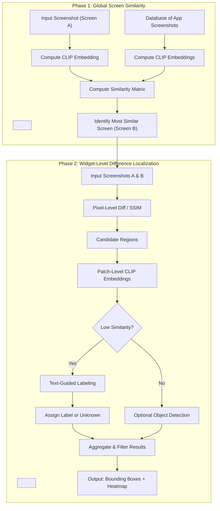

# research-phase2

## Research Phase 2: Localizing Widget-Level Differences in UI Screens

Conducted under Dingbang Wang and Prof. Tingting Yu

### Background: Phase 1 - Global CLIP-Based UI Screen Similarity
This project builds on [Phase 1: Image–Image Retrieval for Distinguishing UI Screens with CLIP Embeddings](https://github.com/cooperfrank/research-phase1). Phase 1 explored whether OpenAI's CLIP embeddings can distinguish between different UI screens within the same mobile app. Using screenshots captured from the Amaze app, the system encoded each image into CLIP embeddings and computed pairwise cosine similarity scores to quantify visual and semantic relatedness. Results showed that CLIP effectively identified screens belonging to the same page (e.g., multiple “Settings” variants) while differentiating distinct views. A Flask web app enabled interactive comparison between screenshots, supporting visualization through similarity heatmaps.

Building on this foundation, Phase 2 extends the functionality to detect and localize widget-level differences within and across app screens.

