# research-phase2

## Research Phase 2: Localizing Widget-Level Differences in UI Screens
*Conducted under Dingbang Wang and Prof. Tingting Yu*

### Background: Phase 1 - Global CLIP-Based UI Screen Similarity
This project builds on [Phase 1: Image–Image Retrieval for Distinguishing UI Screens with CLIP Embeddings](https://github.com/cooperfrank/research-phase1). Phase 1 explored whether OpenAI's CLIP embeddings can distinguish between different UI screens within the same mobile app. Using screenshots captured from the Amaze app, the system encoded each image into CLIP embeddings and computed pairwise cosine similarity scores to quantify visual and semantic relatedness. Results showed that CLIP effectively identified screens belonging to the same page (e.g., multiple “Settings” variants) while differentiating distinct views. A Flask web app enabled interactive comparison between screenshots, supporting visualization through similarity heatmaps.

Building on this foundation, Phase 2 extends the functionality to detect and localize widget-level differences within and across app screens.

### Pipeline Diagram: Phase 1 + 2

```mermaid
graph TD

subgraph Phase1["Phase 1: Global Screen Similarity"]
    A0["Input Screenshot (Raw)"] --> A1["Crop Unnecessary Elements (Screen A)"]
    A1 --> B1["Compute CLIP Embedding"]
    A2["Database of Pre-Cropped App Screenshots"] --> B2["Compute CLIP Embeddings"]
    B1 --> C1["Compute Similarity Matrix"]
    B2 --> C1
    C1 --> D1["Identify Most Similar Screen (Screen B)"]
end

subgraph Phase2["Phase 2: Widget-Level Difference Localization"]
    A["Input Screenshots A & B"] --> B["Pixel-Level Diff / SSIM"]
    B --> C["Candidate Regions"]
    C --> D["Patch-Level CLIP Embeddings"]
    D --> E{"Low Similarity?"}
    E -->|Yes| F["Text-Guided Labeling"]
    F --> G["Aggregate & Filter Results"]
    E -->|No| G
    G --> H["Output: Bounding Boxes + Heatmap"]
end 
```

### Pipeline Explanation

The pipeline operates in two phases to analyze and interpret app screenshots.

#### Phase 1: Global Screen Similarity
This phase determines which known screen in the database most closely matches the given input screenshot.

1. **Input Screenshot (Screen A):** A new or test screenshot to analyze.  
2. **Database of App Screenshots:** A collection of previously captured and labeled app screens.  
3. **CLIP Embedding Computation:** Both the input and database screenshots are converted into CLIP embeddings (compact numerical representations capturing visual and semantic content).
4. **Similarity Matrix:** The cosine similarity between embeddings is computed to identify the closest match.  
5. **Output (Screen B):** The database screen most similar to the input, used for fine-grained comparison in the next phase.

#### **Phase 2: Widget-Level Difference Localization**
Once the most similar screen is identified, this phase focuses on detecting and labeling UI element differences between the two screens.

1. **Pixel-Level Diff / SSIM:** Highlights regions of significant visual change between Screens A and B, used to identify candidate regions for differences between the screenshots.  
2. **Candidate Regions:** Extracted patches potentially representing modified or new UI components.  
3. **Patch-Level CLIP Embeddings:** Each patch is embedded using CLIP to assess its semantic similarity to known UI element descriptions.  
4. **Low Similarity Check:** Determines whether a patch represents a changed element by measuring if its similarity to the corresponding patch in the reference (database) screen is below a set threshold. 
    - **Yes -> Text-Guided Labeling:** The patch is compared with textual labels (e.g., "button", "input box") to assign meaning or marked as "unknown". 
5. **Aggregation & Output:** All results are combined into bounding boxes and heatmaps, visualizing the detected changes and labeled UI elements.