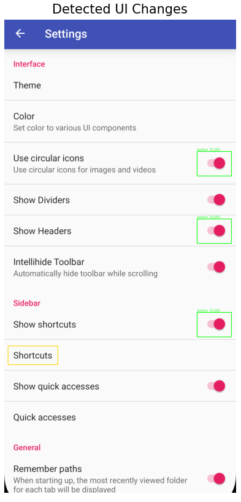

# Research Phase 2: Localizing Widget-Level Differences in UI Screens - Report
Cooper Frank

*Conducted under Dingbang Wang and Prof. Tingting Yu*

## Background
Phase 1 investigated the use of OpenAI's CLIP model to measure semantic similarity between full UI screenshots. Each screenshot from the *Amaze* app was encoded into a CLIP embedding, and the program mapped an input screen to the most similar known screen in the dataset by computing pairwise cosine similarities between embeddings. The results demonstrated that CLIP could:

- Recognize different variants of the same page (e.g., "Settings" screens).
- Distinguish semantically distinct screens (e.g., "Profile" vs. "Search").

## Phase 2
Building upon Phase 1, Phase 2 transitions from global screen understanding to localized UI difference analysis. Once the most similar screen (Screen B) is identified for a given input (Screen A), the system zooms in to detect and interpret widget-level changes such as toggles switching states or buttons being added/removed. The main objective is to **automatically identify, localize, and label UI elements that differ between two semantically similar app screens.**

## Pipeline
The `widget_diff.py` performs the following pipeline for two input images:

### 1. Input pairing & size alignment
Given two screenshots A and B, the pipeline loads them and, if needed, resizes B to A's dimensions so every pixel/location corresponds. This happens at the start of `localize_and_label_changes(...)` using OpenCV resize.

### 2. Pixel-Level Change Detection (SSIM) --> Candidate Difference Regions
The function `_extract_boxes_and_diff()` computes a Structural Similarity Index (SSIM) between the two screenshots.

It produces:
- A difference map showing where visual changes occur.
- Contours representing candidate UI regions that may have changed.
- Bounding boxes outlining these regions.

This step converts raw pixel differences into discrete UI patches where significant change occured for further semantic analysis.

### 3. Semantic embeddings with CLIP
We switch from pixels to semantics. `_load_clip(...)` loads the CLIP model; `_embed_images(...)` encodes each patch into a normalized embedding.

- `_upscale_min_side(...)` ensures patches meet a minimum resolution before CLIP preprocessing.

### 4. Change Validation via Embedding Similarity

The cosine similarity between patches from Screen A and Screen B determines whether a region has meaningfully changed:

- High similarity (>= 0.95): Region is likely unchanged.
- Low similarity (< 0.95): Region has changed visually or semantically.

If the similarity falls below `change_sim_threshold`, we mark the region as changed (with a green box); otherwise it's unchanged (gold box). This step filters out purely visual noise and focuses on semantic differences.

### 5. Text-Guided Semantic Labeling

The function `_embed_texts()` computes CLIP embeddings for a set of descriptive text prompts such as:

- "a mobile toggle switch", "a text input field in a form", "a checkbox control in a list".

Each changed region's embedding is compared with these textual embeddings. The label with the highest cosine similarity is selected, and a concise display label (e.g., "toggle", "button", "text") is used for visualization.

- If no strong match (similarity < 0.23) is found, the system labels the region as "unknown".

### 6. Aggregation and Visualization
Results are combined into an annotated output:
- Green boxes: Regions classified as "changed."
- Gold boxes: Regions detected visually but deemed semantically unchanged.

Each green box includes its predicted label and similarity score (e.g., toggle (0.31)).

The pipeline outputs:
- `overlay_rgb`: visualization with bounding boxes and labels.
- `results`: structured metadata for each detected region.
- `diff_u8` and `mask`: SSIM-based change maps for debugging or heatmap generation.

## Testing
### Inputs
In this test, the system compares two *Amaze* app settings screens: `settings_1.png` and `settings_2.png`, to highlight structural and semantic changes using SSIM and CLIP embeddings. The only differences between these screenshots is some toggles being in a different state.

### Results

The system successfully identified several toggle switches that changed states between the two screenshots.  
Each changed region was correctly localized (green boxes), showing high sensitivity to structural differences between "on" and "off" toggle states.

However, the model misclassified these toggles as buttons instead of toggle switches. This labeling error stems from how the CLIP text embedding space interprets the prompt set. The current prompts (for example, "a mobile toggle switch" and "a settings screen toggle") may not be semantically distinct enough from "a mobile UI button".  

I have been experimenting with prompt phrasing and adjusting similarity thresholds to improve label accuracy. Increasing the diversity of toggle-related prompts or raising the `label_sim_threshold` may help the model distinguish them more reliably.

### Observations
- Correct detection, incorrect labeling:  
    - The model accurately identified the toggles that changed but labeled them as buttons. This suggests that visual semantics were captured, but text-prompt discrimination needs refinement.

- Alignment issue handled correctly:  
    - A small text alignment shift occurred near the "Shortcuts" label between the two screenshots. The system correctly recognized that this change was not significant enough to warrant further semantic analysis, demonstrating effective noise filtering.

### Conclusion
The current pipeline of combining SSIM-based pixel difference detection with CLIP-based semantic labeling performs well at localizing UI element changes but still requires tuning for prompt sensitivity and threshold calibration.  

The next step will involve refining text prompts, testing multiple CLIP variants, and adjusting similarity cutoffs to improve classification precision for specific UI elements like toggles and buttons.
